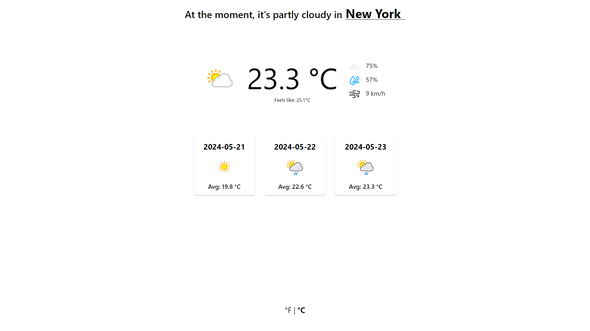
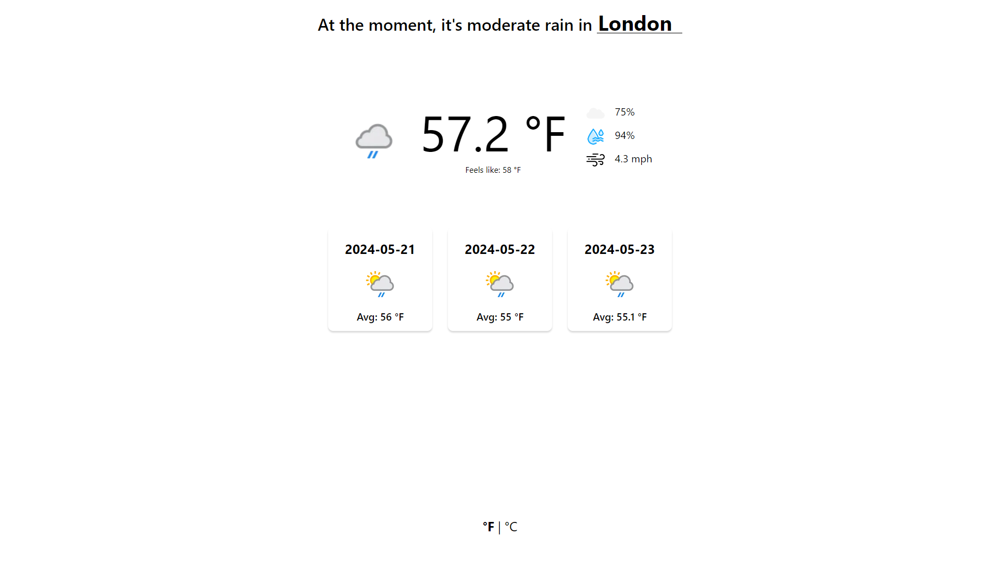

# Weather-App

## A functional weather app written in JavaScript and using Weather API

This project is a weather app built for The Odin Project, showing the weather in different cities, countries etc... This project is written in Javascript, HTML and CSS and it does the following: 

* Show you the weather in any place you want
* Show the avarage temperature for the next 2 days
* Change between fahrenheit and celsius 
* Show winds, humidity and clouds
* Show how the weather feels like

## How it looks like: 

### Celsius

### Fahrenheit

## How to use it

Using this project is pretty simple.
You just click on the name of the city (deafult one is London) then just type whatever place you want to. If you've misspelled anything you will get an error saying to check again. 

## How to change between celsius and fahrenheit 

You need to click the little '°F | °C' at the bottom of the page and it changes it.